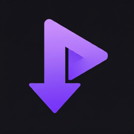

# QuickClip — Android Video Downloader

<p align="center">
  
</p>

<p align="center">
  A fast, fully offline-capable video downloader for Android. Powered by a native <strong>yt-dlp</strong> binary and a layered extractor system, QuickClip supports 1 000+ platforms — from YouTube and Instagram to essentially any public video URL.
</p>

<p align="center">
  
  
  
  
  
</p>

---

## Table of Contents

- [Features](#features)
- [Architecture Overview](#architecture-overview)
- [Directory Structure](#directory-structure)
- [Layer Deep-Dives](#layer-deep-dives)
  - [Extraction Pipeline](#extraction-pipeline)
  - [Native Android Bridge (Kotlin)](#native-android-bridge-kotlin)
  - [Download Engine](#download-engine)
  - [State Management](#state-management)
  - [Navigation](#navigation)
  - [Theming](#theming)
- [Getting Started](#getting-started)
- [Key Dependencies](#key-dependencies)

---

## Features

- **100% on-device extraction** — powered by a bundled yt-dlp binary with support for 1 000+ platforms. No third-party servers, no rate limits.
- **Clip downloads** — trim a video to a custom start/end timestamp before downloading. Only the requested segment is fetched.
- **Concurrent downloads** — up to 5 simultaneous downloads, running at the app root so they continue regardless of which screen is active.
- **Share intent** — share any URL directly from a browser or social app into QuickClip via the Android share sheet.
- **Folder-based library** — organize downloads into custom folders with system-pinned Favorites and Saved for Later collections. Library state is persisted and reconciled against real files on disk at startup.
- **Material You theming** — dynamically builds a full M3 dark theme from the device's wallpaper color palette (Android 12+).

---

## Architecture Overview

```
┌─────────────────────────────────────────────┐
│                  React Native UI             │
│   HomeScreen  LibraryScreen  DownloadsScreen │
│   SettingsScreen  FolderDetailScreen         │
└────────────────┬────────────────────────────┘
                 │ Zustand stores
┌────────────────▼────────────────────────────┐
│              State Layer                     │
│  downloadStore   settingsStore   appStore    │
└────────────────┬────────────────────────────┘
                 │ hooks
┌────────────────▼────────────────────────────┐
│           Service / Logic Layer              │
│  useDownloadEngine   NotificationService     │
│  ExtractorRegistry   StorageService          │
└────────────────┬────────────────────────────┘
                 │ JS ↔ Native bridge
┌────────────────▼────────────────────────────┐
│         Native Android Module (Kotlin)       │
│   YtDlpModule  —  youtubedl-android lib      │
│   ShareActivity  MainActivity                │
└─────────────────────────────────────────────┘
```

---

## Directory Structure

```
QuickClip-Android/
├── android/                          # Android native layer
│   └── app/src/main/java/com/universaldownloader/
│       ├── MainActivity.kt           # RN host activity
│       ├── MainApplication.kt        # RN application class
│       ├── ShareActivity.kt          # Receives share-sheet intents
│       ├── YtDlpModule.kt            # Native yt-dlp bridge (↑ core)
│       └── YtDlpPackage.kt           # Registers YtDlpModule with RN
│
├── src/
│   ├── components/                   # Reusable UI components
│   │   ├── VideoCard.tsx             # Video preview + format picker
│   │   ├── ClipSelector.tsx          # Timeline clip trimmer
│   │   ├── ClipboardBanner.tsx       # Auto-detected URL prompt
│   │   ├── UrlInput.tsx              # Primary URL entry field
│   │   ├── PlatformGrid.tsx          # Platform quick-launch grid
│   │   ├── RecentDownloads.tsx       # Home screen recent strip
│   │   ├── StatsCard.tsx             # Aggregate download stats
│   │   ├── FolderPickerSheet.tsx     # Bottom sheet folder chooser
│   │   ├── DirectoryPickerSheet.tsx  # Native directory picker wrapper
│   │   └── CreateFolderDialog.tsx    # New folder dialog
│   │
│   ├── screens/
│   │   ├── HomeScreen.tsx            # URL input, extraction, recent items
│   │   ├── DownloadsScreen.tsx       # Active + completed download list
│   │   ├── LibraryScreen.tsx         # Folder browser
│   │   ├── FolderDetailScreen.tsx    # Per-folder media grid/list
│   │   ├── SettingsScreen.tsx        # App preferences
│   │   └── SharePopupScreen.tsx      # Share-intent confirmation modal
│   │
│   ├── hooks/
│   │   ├── useDownloadEngine.ts      # Global download queue processor
│   │   ├── useClipboard.ts           # Clipboard URL detection
│   │   ├── useSharedContent.ts       # Share-intent listener
│   │   ├── usePermissions.ts         # Android runtime permissions
│   │   └── usePlatformDetector.ts    # URL → platform mapping
│   │
│   ├── services/
│   │   ├── extractors/
│   │   │   ├── ytdlpBridge.ts        # JS wrapper for YtDlpModule RN bridge
│   │   │   ├── YtDlpExtractor.ts     # Extractor class (native path)
│   │   │   ├── YouTubeExtractor.ts   # YouTube-specific fallback
│   │   │   ├── InstagramExtractor.ts # Instagram-specific fallback
│   │   │   ├── FacebookExtractor.ts  # Facebook-specific fallback
│   │   │   └── index.ts              # ExtractorRegistry (chain-of-responsibility)
│   │   ├── downloader/
│   │   │   ├── DownloadManager.ts    # Download orchestration helpers
│   │   │   └── StorageService.ts     # File-system read/write helpers
│   │   └── NotificationService.ts    # Notifee push notification wrappers
│   │
│   ├── store/
│   │   ├── downloadStore.ts          # Downloads, folders, favorites, saved items
│   │   ├── settingsStore.ts          # User preferences (quality, path, concurrency)
│   │   └── appStore.ts               # Transient UI state (loading, errors)
│   │
│   ├── navigation/
│   │   └── RootNavigator.tsx         # Tab + stack navigator setup
│   │
│   ├── types/
│   │   ├── download.ts               # DownloadItem, Folder, SavedItem, FavoriteItem
│   │   ├── extractor.ts              # VideoExtractor interface, VideoInfo, VideoFormat
│   │   └── video.ts                  # Supplementary video types
│   │
│   ├── constants/
│   │   ├── theme.ts                  # Material You dynamic theme builder
│   │   ├── colors.ts                 # SPACING, RADIUS, color tokens
│   │   ├── platforms.ts              # Supported platforms, URLs, quality presets
│   │   └── config.ts                 # App-wide configuration constants
│   │
│   └── utils/
│       ├── common.ts                 # generateId, sanitizeFilename, formatters
│       ├── fileSystem.ts             # RNFS helpers (exists, mkdir, move)
│       ├── errorHandler.ts           # ExtractionError, typed error helpers
│       ├── platformDetector.ts       # URL → PlatformType regex matching
│       └── shareTracker.ts           # Share-intent deduplication
│
├── App.tsx                           # Root component, startup sequence
└── index.js                          # RN entry point
```

---

## Layer Deep-Dives

### Extraction Pipeline

Extraction follows a **chain-of-responsibility** pattern managed by `ExtractorRegistry` in `src/services/extractors/index.ts`:

```
URL
 │
 ▼
YtDlpExtractor      ← primary (native binary, 1000+ sites)
 │ fails
 ▼
YouTubeExtractor    ← YouTube-specific JS fallback
 │ fails
 ▼
InstagramExtractor  ← Instagram-specific JS fallback
 │ fails
 ▼
FacebookExtractor   ← Facebook-specific JS fallback
 │ all fail
 ▼
throw error         ← "Could not extract video info. Make sure the URL
                       is supported by yt-dlp and try again."
```

Each extractor implements the `VideoExtractor` interface:

```ts
interface VideoExtractor {
  canHandle(url: string): boolean;
  extract(url: string): Promise<VideoInfo>;
}
```

The registry tries each in order, swallowing individual errors and only throwing once all options are exhausted. The platform-specific JS extractors (YouTube, Instagram, Facebook) act as thin fallbacks within the chain; yt-dlp handles the vast majority of URLs on its own. New extractors can be registered at runtime via `extractorRegistry.addExtractor(extractor, priority?)`.

`VideoInfo` carries the full metadata (title, thumbnail, duration, uploader, view count) plus an array of `VideoFormat` objects. Each format records quality label, direct URL, codec, FPS, file size estimate, and `hasAudio`/`hasVideo` flags — everything the UI and download engine need to start a download.

---

### Native Android Bridge (Kotlin)

`YtDlpModule.kt` is a React Native `NativeModule` that wraps the [youtubedl-android](https://github.com/yausername/youtubedl-android) library. It exposes these `@ReactMethod` calls to JavaScript:

| Method | Purpose |
|---|---|
| `getVideoInfo(url)` | Runs `yt-dlp --dump-json` and returns parsed format list |
| `downloadVideo(id, url, outputPath, formatSelector, isAudio)` | Starts a yt-dlp download, emitting `YtDlpProgress` events |
| `downloadVideoSection(id, url, path, fmt, isAudio, start, end)` | Same, but with `--download-sections` for clip support |
| `cancelDownload(id)` | Kills the running yt-dlp coroutine by ID |
| `updateYtDlp()` | Self-updates the bundled yt-dlp binary from GitHub |

Progress is streamed back to JavaScript via React Native's `DeviceEventManager` as `YtDlpProgress` events containing `{ id, progress, eta, line }`.

`ShareActivity.kt` is a separate Android `Activity` registered in `AndroidManifest.xml` as an `ACTION_SEND` / `ACTION_VIEW` intent filter. When a user shares a URL from Chrome or another app, Android routes it to `ShareActivity`, which passes the URL to the JS layer and navigates to `SharePopupScreen`.

---

### Download Engine

`useDownloadEngine` (mounted once at the `AppContent` level in `App.tsx`) is the heartbeat of all downloads:

1. **Watches** `downloadStore.downloads` for items in `pending` status.
2. **Picks up** each pending item (up to the configured concurrency limit), marks it `downloading`, and calls the appropriate native method — either `downloadVideo` or `downloadVideoSection` for clips.
3. **Throttles** progress events to at most one UI update per 500 ms, parsing speed from yt-dlp's raw output lines (e.g. `at 3.2 MiB/s`).
4. **Handles completion** by marking status `completed`, recording `filePath`, and showing a Notifee notification.
5. **Handles cancellation** — checks for `YTDLP_CANCELLED` error codes vs. genuine failures and sets status accordingly.
6. **Creates directories** (`QuickClip/`) before each download and auto-increments filenames to avoid overwrites.

Because the hook lives at the root `AppContent` component, downloads continue while the user navigates between Home and Library tabs.

---

### State Management

The app uses three [Zustand](https://github.com/pmndrs/zustand) stores:

**`downloadStore`** — the largest store. Holds:
- `downloads: Record<string, DownloadItem>` — active and completed downloads
- `folders: Record<string, Folder>` — user folders + two system folders
- `saved: Record<string, SavedItem>` — "save for later" queue
- `favorites: Record<string, FavoriteItem>` — starred items

On every relevant mutation, completed downloads are persisted to `.downloads_meta.json` inside the active download directory. `loadFromFilesystem()` runs once at startup: it reads that JSON, scans the real directory for `.mp4`/`.mp3` files, merges the two views, and prunes stale entries. Folders, favorites, and saved items are persisted to separate `.quickclip_*.json` sidecar files.

**`settingsStore`** — persists user preferences to `AsyncStorage`:
- `downloadPath` — custom download directory (default: `Downloads/QuickClip`)
- `defaultQuality` — one of `best | 1080p | 720p | 480p | audio`
- `maxConcurrentDownloads` — 1–5

**`appStore`** — transient UI state (loading spinners, error messages, `pendingExtractUrl` for cross-screen navigation triggers). Nothing here is persisted.

---

### Navigation

`RootNavigator` composes two navigators:

```
NavigationContainer
 └── RootStack (NativeStack, no headers)
      ├── Tabs (BottomTab)               ← default screen
      │    ├── Home  (HomeScreen)
      │    └── Library (LibraryStack)
      │         ├── LibraryMain  (LibraryScreen)
      │         └── FolderDetail (FolderDetailScreen)
      ├── Downloads  (modal, slides up)  ← accessed from Home header badge
      └── Settings   (slides from right) ← accessed from Home header gear icon
```

The active tab indicator uses a pill-shaped highlight (`activeIndicator`) matching the Material 3 Navigation Bar spec.

---

### Theming

`buildDynamicTheme()` in `src/constants/theme.ts` uses `react-native-material-you-colors` to read the device's wallpaper-generated color palette (Android 12+) and compose a full Material 3 dark theme. Both the React Native Paper `PaperProvider` theme and the React Navigation `navTheme` are built from the same palette, so every surface, text, and icon color is coherent. If palette extraction fails (e.g. on older Android), the app falls back to the bundled `MD3DarkTheme`.

---

## Getting Started

### Prerequisites

- **Node.js** ≥ 22.11
- **Android Studio** with SDK 34+ and a connected device or emulator (API 26+)
- **JDK 17**

### Installation

```bash
# 1. Install JS dependencies
npm install

# 2. Start the Metro bundler
npm start

# 3. Build and install on device (in a second terminal)
npm run android
```

On first launch the app will:
1. Load user settings from `AsyncStorage`
2. Load the download library from disk
3. Request notification permission (Android 13+)
4. Check for a yt-dlp binary update in the background

### Release Build

```bash
cd android
./gradlew assembleRelease
# APK at android/app/build/outputs/apk/release/app-release.apk
```

---

## Key Dependencies

| Package | Role |
|---|---|
| `react-native` 0.85 | Core framework |
| `react-native-paper` | Material You 3 UI components |
| `@react-navigation/*` | Tab + stack navigation |
| `zustand` | Lightweight global state |
| `react-native-fs` | Native file-system access |
| `react-native-blob-util` | Chunked binary downloads |
| `@notifee/react-native` | Rich push notifications |
| `react-native-reanimated` | Smooth enter/exit animations |
| `react-native-video` | In-app video playback |
| `react-native-receive-sharing-intent` | Android share-sheet interception |
| `react-native-material-you-colors` | Wallpaper-based color extraction |
| `youtubedl-android` (Kotlin) | Bundled yt-dlp native binary |

---

## Open Source

QuickClip is free and open source software licensed under the [MIT License](./LICENSE).

- **No ads, ever** — there is no advertising, no tracking, and no telemetry of any kind.
- **No paywalls** — every feature is available to everyone, for free.
- **Contributions welcome** — bug fixes, new platform extractors, UI improvements, or anything else. Open an issue or submit a pull request.
- **Fork freely** — build on it, modify it, ship your own version. That's what the license is for.

---

This project was built with assistance from [Claude Opus 4.6](https://anthropic.com) by Anthropic.

---

*Built with React Native, Kotlin, and yt-dlp. Tested on Android 10–15.*
